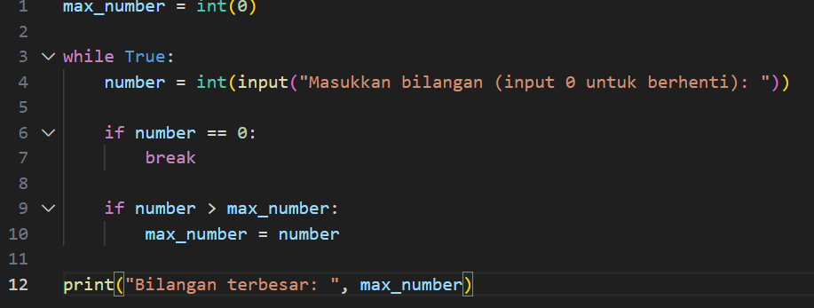

# tugas-pemrogramana
# praktikum3
 ## Menentukan bilangan terbesar

 ### Membuat flowchart
 1. Mulai 
 2. Seting Max = 0 untuk sementara
 3. Masukan bilangan "x"
 4. Apakah x = 0
    Jika ya, maka tampilkan Max dan selasai
    Jika tidak, maka lanjutkan ke no5
 5. Apakah x > Max?
    Jika ya, maka seting Max = x
    jika tidak, kembali ke no3

 Ini adalah flowchart-nya

 

 ### Membuat flowchart menggunakan pyhton
 1. "max_numer" diinisialisasi dengan nilai 0 menggunakan int"(0)".
 2. "while True" membuat loop yang terus berjalan sampai dihentikan dengan break.
 3. pengguna diminta memasukan bilangan 
 4. jika bilangan yang dimasukan adalah 0, loop dihentikan dengan break dan menanpilkan bilangan terbesar"max_numer".
 5. jika tidak, lanjutkan ke no6.
 6. jika bilangan yang dimasukan lebih besar dari "max_numer", maka "max_numer" diperbarui dan jika tidak lebih besar maka "max_numer" masih sama.
 7. lalu kembali ke no3

 Ini adalah flowchart menggunakan pyhton
 

 Ini adalah gambar hasil dari pyhton yang sudah dimasukan bilangan
 